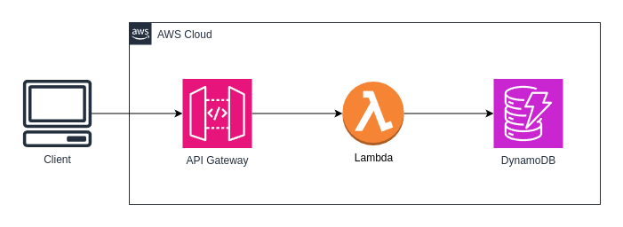
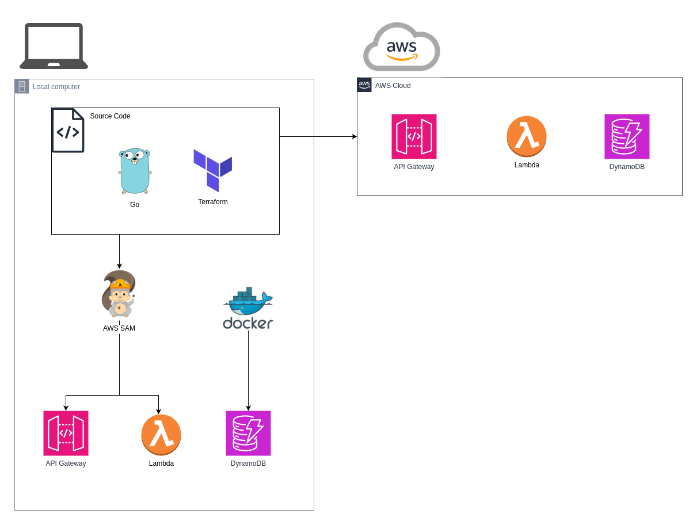

# swim-api
A serverless Rest API written in Go with AWS Lambda and DynamoDB.


### Dependencies
- Go version >1.22
- docker
- docker-compose
- awscli
- sam
- terraform

### Local testing
- Clone repository: ``git clone https://github.com/l4rma/swim-api.git``
- Compile code: ``make build``
- Run API locally: ``make sam``

#### Running with DynamoDB locally with docker
- Run local dynamoDB: ``docker-compose up -d``
- Create table in local dynamoDB:
```bash
aws dynamodb create-table \
    --table-name SwimmersAndSessions \
    --attribute-definitions \
        AttributeName=PK,AttributeType=S \
        AttributeName=SK,AttributeType=S \
    --key-schema \
        AttributeName=PK,KeyType=HASH \
        AttributeName=SK,KeyType=RANGE \
    --provisioned-throughput \
        ReadCapacityUnits=5,WriteCapacityUnits=5 \
    --table-class STANDARD \
	--endpoint-url http://localhost:8000
```



#### Example requests
```bash
# Add swimmer
curl localhost:3000/swimmers/add -H "application/json" -d '{"name":"Lars","age":35}'
# Get all swimmers
curl localhost:3000/swimmers | jq
```

### Todo:
- [x] Create MVP with inmemory DB
- [x] Add controller for update function
- [x] Add a repository for DynamoDB
- [ ] Add tests
- [ ] Full CRUD
- [x] Make serverless with lambda and DynamoDB
- [x] Run locally with SAM, Terraform and Docker
- [ ] Add CI/CD pipeline
- [ ] Add authentication
- ...

## DynamoDB Table Schema `SwimmersAndSessions`

| Attribute Name       | Type      | Key Type        | Description                                                       |
|----------------------|-----------|-----------------|-------------------------------------------------------------------|
| `PK`                | `String`  | Partition Key   | Partition key, `SWIMMER#<SwimmerID>`. |
| `SK`                | `String`  | Sort Key        | Sort key, either `PROFILE` for swimmer or `SESSION#<SessionID>` for session. |
| `Name`              | `String`  | Attribute       | Name of the swimmer (for swimmer profiles).                      |
| `Age`               | `Number`  | Attribute       | Age of the swimmer (for swimmer profiles).                       |
| `CreatedAt`         | `String`  | Attribute       | ISO 8601 timestamp of swimmer profile creation.                  |
| `IsActive`          | `Boolean` | Attribute       | Whether the swimmer profile is active.                           |
| `Date`              | `String`  | Attribute       | ISO 8601 date of the session.                                    |
| `Distance`          | `Number`  | Attribute       | Total distance swum during the session (in meters).              |
| `Duration`          | `Number`  | Attribute       | Duration of the session (in minutes).                            |
| `Intensity`         | `String`  | Attribute       | Intensity level of the session (e.g., "low", "moderate", "high").|
| `Style`             | `String`  | Attribute       | Swimming style (e.g., "freestyle", "butterfly").                 |
| `Notes`             | `String`  | Attribute       | Additional notes about the session.                              |

